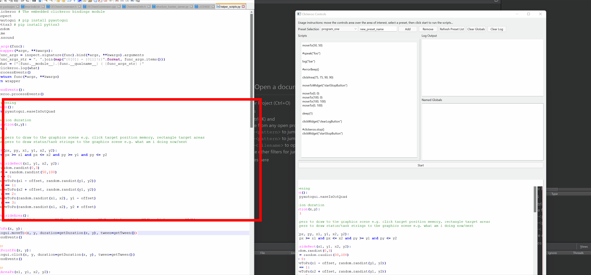

# Clickeroo

Clickeroo is a tool for clicking things.

I adapted this from some existing code I had lying around for the Optibrium March 2022 Hackathon.

# Building

Install Python 3.10+ and edit clickeroo.pro, adding the path to Python to LIBS, INCLUDEPATH and DEPENDPATH.

Install the pip packages:

```
pyautogui # pip install pyautogui
pyttsx3 # pip install pyttsx3
```

Then open and run the project in Qt Creator.

# Usage

Run the clicker application and press the "Start" button to run the selected script shown in the script editor panel.

Depending on the script, this will usually perform some simple actions like moving the mouse and then stop.

# Screenshots



# Notes

 * I'm not planning to work on this further. It would eventually end up looking like some existing macro software like [AutoIt](https://www.autoitscript.com/site/)/[AutoHotKey](https://www.autohotkey.com/) or automated GUI testing tools like [Squish](https://www.froglogic.com/squish/editions/qt-gui-test-automation/).
 * Uses pyautogui, pyttsx3, [QHotkey](https://github.com/Skycoder42/QHotkey) and [pybind11](https://github.com/pybind/pybind11) libraries.
 